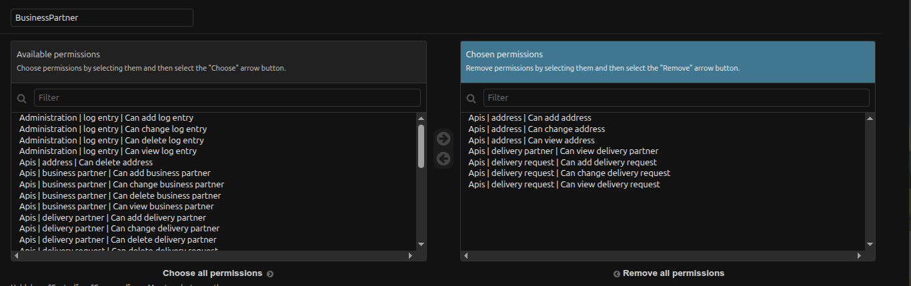
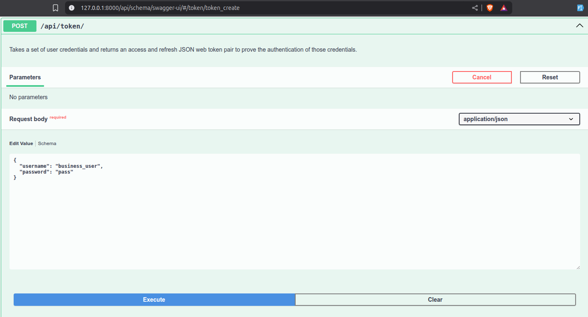
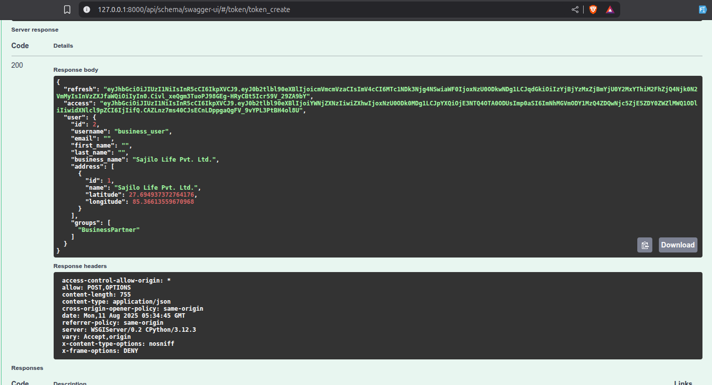
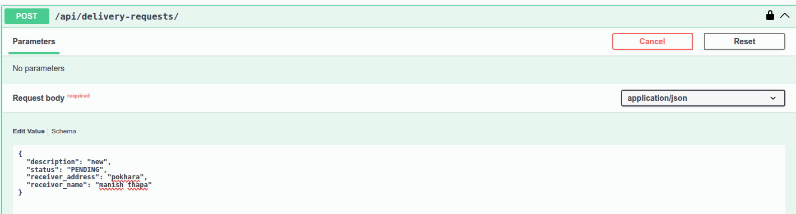
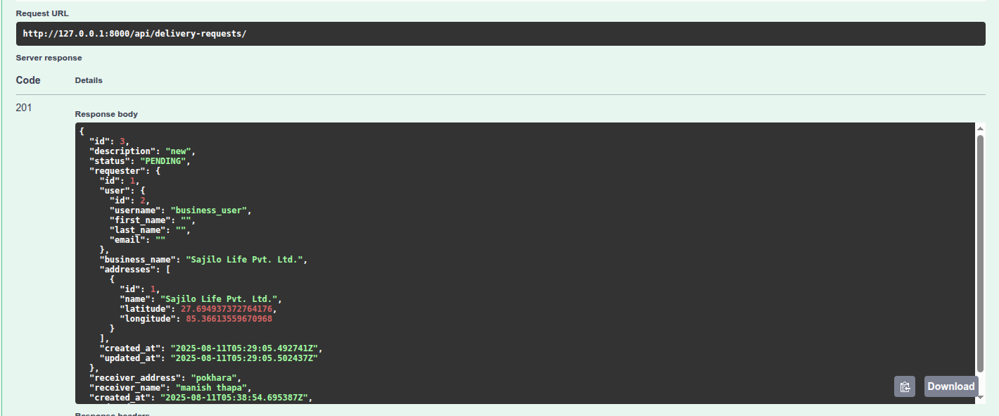
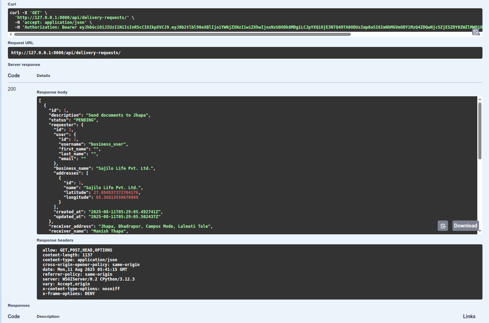
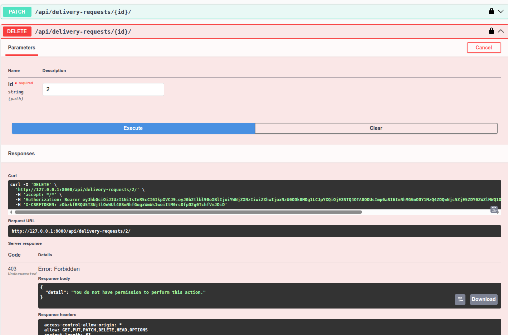

# Delivery Aggregator Platform — Setup & Permissions Guide

## Getting Started

Follow these steps to run the project locally:

1. Clone the repository

   ```bash
   git clone https://github.com/prakashtaz0091/Delivery-Aggregator-Platform
   ```

2. Navigate into the project directory

   ```bash
   cd Delivery-Aggregator-Platform
   ```

3. Create and activate a virtual environment

   ```bash
   python -m venv venv
   source venv/bin/activate  # Linux/Mac
   venv\Scripts\activate     # Windows
   ```

4. Run migrations

   ```bash
   python manage.py migrate
   ```

5. Seed example data

   ```bash
   python manage.py seed_example
   ```

   This will create example users, groups, and permissions.

6. Run the development server

   ```bash
   python manage.py runserver
   ```

## Have docker installed ?

## Build and Run with Docker

1. Build the Docker image:

   ```bash
   docker build -t delivery-aggregator .
   ```

2. Run the Docker container:

   ```bash
   docker run -d -p 8000:8000 delivery-aggregator
   ```

---

## Admin panel login credentials:

- Username: `admin`
- Password: `pass`

Admin panel: [http://127.0.0.1:8000/admin](http://127.0.0.1:8000/admin)
API documentation: [http://127.0.0.1:8000/api/schema/swagger-ui/](http://127.0.0.1:8000/api/schema/swagger-ui/)

---

## Default Business Partner Permissions

When seeded, the **BusinessPartner** group is automatically assigned the following permissions:


---

## Verifying Permissions

### Step 0 — Login as Business Partner

- Username: `business_user`
- Password: `pass`




---

### Step 1 — Create Delivery Request

Business partners can create new delivery requests.



---

### Step 2 — View Delivery Requests

Business partners can view only their own delivery requests.


---

### Step 3 — Cannot Delete Delivery Requests

Once created, delivery requests cannot be deleted by business partners.


---

### Admin has full access to all using django admin panel

#### Use username `admin` and password `pass` to login to admin panel
